# 🏢 DJ HRMS — Human Resource Management System

**A full multi-tenant HR platform** — employee records, biometric + face-recognition attendance, leaves, payroll, recruitment, expenses, an employee self-service portal, internal messaging, an AI HR assistant, and more — built with Django and Tailwind CSS.

> 🚀 **Custom UI throughout** — no default Django admin screens for day-to-day use. Every module (HR side and employee side) has its own purpose-built interface.

---

## 📌 Overview

DJ HRMS started as a straightforward employee/attendance/payroll manager and has grown into a full multi-module HR suite with two separate front-ends:

- **HR / Admin Dashboard** — for HR staff and admins to manage the whole company.
- **Employee Portal ("WorkForce")** — a self-service space where employees check their own attendance, apply for leave/WFH, and view payslips.

On top of that, the platform supports **multi-tenancy**, so it can be run as a SaaS product with multiple companies each on their own isolated database.

---

## ✨ Features

### 👥 Employee Management
- Full employee profiles with photo upload, department, designation, employment type and status
- Department & Designation management
- Project assignment and employee status history (audit trail of status changes)
- Performance reviews and performance goals
- Company-wide branding: logo, primary color and text color, configurable from the admin (`SiteSettings`)
- Full audit log of changes across the system (who changed what, old value → new value)

### ⏰ Attendance Tracking
- Daily attendance marking with check-in / check-out, plus bulk "Mark All" for a team
- Status types: Present, Absent, Late, WFH, Half Day, Holiday
- Monthly attendance calendar with color-coded status per day
- **Punch-log based attendance** — every punch in/out is logged individually (`PunchLog`), and the day's attendance record is derived from that log, so break time and total worked hours are always computed from real punches rather than edited by hand
- **Biometric device integration** — physical fingerprint/biometric machines (ZKTeco, eSSL and similar, using the ADMS push protocol) auto-register with the server and push punch logs directly (`BiometricDevice`, `BiometricRawLog`)
- **Face-recognition attendance** — browser-based face capture (face-api.js) with server-side 128-point descriptor matching for punching in/out (`FaceEncoding`, face descriptor matching in `attendance/face_utils.py`)
- Work From Home requests with an approval workflow that auto-marks attendance as WFH once approved
- Attendance dispute workflow for employees to flag incorrect records
- Configurable shift timings and company holiday calendar

### 🏖️ Leave Management
- Multiple configurable leave types (paid/unpaid, days allowed per year, carry-forward rules)
- Leave request submission with approval workflow and comment threads
- Leave balance tracking per employee, per year
- Leave history visible to both HR and the employee

### 💰 Payroll
- Salary structure management built from configurable salary components (Basic, HRA, allowances, etc.)
- Automatic gross & net salary calculation
- Monthly payslip generation with LOP (Loss of Pay) handling
- Employees can view their own salary structure and payslip history from the portal

### 🤝 Recruitment
- Job opening management with vacancies and deadlines
- Candidate pipeline: Applied → Screening → Interview → Offer → Hired
- Interview scheduling with feedback and ratings, multi-round support

### 💸 Expenses
- Expense claim submission with an approval workflow and reviewer comments

### 📅 Events & 🧘 Wellness
- Company events calendar
- Wellness resources module for sharing employee well-being content

### 📖 Help Center
- Policy categories and policy documents, so employees can look up company policies without going through HR

### 💬 Internal Messaging
- One-to-one conversations between employees, with read receipts
- Real online/offline presence, driven by an actual "last seen" timestamp (not a hardcoded label)

### 🔔 Announcements & Notifications
- Super-admin announcements broadcast to all active employees, each generating a notification
- Per-user notification feed across modules (leave approvals, announcements, WFH decisions, etc.)
- Automatic birthday reminders

### 🤖 AI HR Assistant
- In-app chatbot (powered by the Anthropic API) that answers questions using **live data pulled straight from the HRMS database** — employee lists, today's attendance, pending leave/WFH requests, and more — rather than static or hallucinated answers

### 🏢 Multi-Tenancy (SaaS mode)
- Each customer ("tenant") gets its own isolated database, keyed by subdomain
- Per-tenant plan (Basic / Pro / Enterprise), employee limits, and enabled-module list
- Recharge/expiry system — dashboard access locks automatically once a tenant's plan expires, and a recharge log tracks every payment that extends it
- Central tenant-management screen for the platform owner to view, activate, suspend or recharge every customer from one place

### 🔐 Roles & Permissions
- Separate login flows for HR/Admin and Employees
- Role-based access control, with a distinct "primary admin" (super admin) role for sensitive actions like announcements
- Secure session-based authentication, with password reset

### 🌐 REST API Ready
- Full REST API built with Django REST Framework, covering every module above
- Token-based authentication
- Pagination, filtering, and search on all endpoints
- CORS configured for React/mobile app integration

---

## 🛠️ Tech Stack

| Layer | Technology |
|-------|-----------|
| **Backend** | Python 3, Django 6.0 |
| **REST API** | Django REST Framework |
| **Frontend** | Tailwind CSS (CDN), Vanilla JS |
| **Face Recognition** | face-api.js (browser) + server-side descriptor matching |
| **AI Assistant** | Anthropic API (`anthropic` Python SDK) |
| **Icons** | Font Awesome 6 |
| **Fonts** | Inter (Google Fonts) |
| **Database** | SQLite (dev) / MySQL / PostgreSQL (prod); isolated per-tenant DB for SaaS mode |
| **Auth** | Django Auth + Token Auth (DRF) |
| **Media** | Pillow (image handling) |
| **Config** | python-decouple (environment variables) |
| **Deployment** | Gunicorn + WhiteNoise |

---

## 📁 Project Structure

```
hrms_project/
│
├── hrms/                    # Project config (settings, urls, root views)
├── employees/               # Employees, departments, designations, roles,
│                             #   projects, performance, announcements,
│                             #   notifications, audit log, auth & portal views,
│                             #   chatbot, birthdays, dashboard analytics
├── attendance/               # Daily/monthly attendance, punch logs,
│                             #   biometric devices, face recognition, WFH,
│                             #   holidays, disputes
├── leaves/                  # Leave types, requests, balances, comments
├── payroll/                 # Salary components/structures, payslips
├── recruitment/             # Job openings, candidates, interviews
├── expenses/                # Expense claims & comments
├── events/                  # Company events
├── wellness/                # Wellness resources
├── helpcenter/              # Policy categories & documents
├── messaging/                # Conversations, messages, read receipts
├── tenants/                  # Multi-tenant SaaS management (plans,
│                             #   recharge, per-tenant DB routing)
│
├── templates/
│   ├── base.html            # Master layout with sidebar (HR/Admin side)
│   ├── dashboard/            # HR dashboard
│   ├── employees/, attendance/, leaves/, payroll/, recruitment/
│   ├── events/, expenses/, helpcenter/, wellness/, messaging/
│   ├── portal/               # Employee self-service portal ("WorkForce")
│   ├── chatbot/              # AI assistant widget
│   ├── auth/, registration/  # Login / password reset
│
├── static/                  # CSS, JS, face-api.js models
├── media/                   # Uploaded files (employee photos, company logo, policy docs)
├── projectscreenshot/       # README screenshots
└── manage.py
```

---

## ⚙️ Installation

### Prerequisites
- Python 3.10+
- pip
- Git

### Steps

```bash
# 1. Clone the repository
git clone https://github.com/dhan2501/HRMS-Product.git
cd HRMS-Product

# 2. Create virtual environment
python -m venv venv
source venv/bin/activate        # Linux/Mac
venv\Scripts\activate           # Windows

# 3. Install dependencies
pip install -r requirements.txt

# 4. Configure environment variables (see below)
cp .env.example .env            # then fill in your own values

# 5. Apply migrations
python manage.py makemigrations
python manage.py migrate

# 6. Create superuser
python manage.py createsuperuser

# 7. Run server
python manage.py runserver
```

Open **http://127.0.0.1:8000** in your browser.

### Environment variables

The project reads configuration via `python-decouple`. At minimum you'll want:

```env
DJANGO_SECRET_KEY=your-secret-key
DEBUG=True
ANTHROPIC_API_KEY=your-anthropic-api-key   # required for the AI HR assistant
```

---

## 📦 Requirements

```txt
Django==6.0.6
djangorestframework==3.17.1
django-cors-headers==4.9.0
django-filter==25.2
pillow==12.2.0
python-decouple==3.8
anthropic==0.120.0
gunicorn==23.0.0
whitenoise==6.11.0
```

Install all:
```bash
pip install -r requirements.txt
```

---

## 🌐 REST API

Base URL: `http://127.0.0.1:8000/api/v1/`

### Authentication
```bash
# Get token
POST /api/v1/auth/token/
Body: { "username": "admin", "password": "password" }

# Use token in headers
Authorization: Token <your_token>
```

### Endpoints

| Module | Endpoint | Methods |
|--------|----------|---------|
| Employees | `/api/v1/employees/` | GET, POST, PUT, DELETE |
| Departments | `/api/v1/departments/` | GET, POST, PUT, DELETE |
| Designations | `/api/v1/designations/` | GET, POST, PUT, DELETE |
| Attendance | `/api/v1/attendance/` | GET, POST, PUT |
| Leave Types | `/api/v1/leave-types/` | GET, POST |
| Leave Requests | `/api/v1/leave-requests/` | GET, POST, PUT |
| Salary Structure | `/api/v1/salary-structures/` | GET, POST, PUT |
| Payslips | `/api/v1/payslips/` | GET, POST |
| Job Openings | `/api/v1/job-openings/` | GET, POST, PUT |
| Candidates | `/api/v1/candidates/` | GET, POST, PUT |
| Interviews | `/api/v1/interviews/` | GET, POST, PUT |
| Expenses | `/api/v1/expense-claims/` | GET, POST, PUT |
| Events | `/api/v1/events/` | GET, POST, PUT |
| Wellness | `/api/v1/wellness-resources/` | GET, POST |
| Messaging | `/api/v1/conversations/`, `/api/v1/messages/` | GET, POST |
| Help Center | `/api/v1/policy-documents/` | GET, POST |
| Tenants | `/api/v1/tenants/` | GET, POST, PUT |

### Custom Actions
```bash
# Approve leave request
POST /api/v1/leave-requests/{id}/approve/

# Reject leave request  
POST /api/v1/leave-requests/{id}/reject/
Body: { "reason": "Insufficient leave balance" }

# Employee attendance summary
GET /api/v1/employees/{id}/attendance_summary/?month=7&year=2026

# Active employees only
GET /api/v1/employees/active/
```

---

## 🗄️ Database Configuration

### SQLite (Development — Default)
```python
DATABASES = {
    'default': {
        'ENGINE': 'django.db.backends.sqlite3',
        'NAME': BASE_DIR / 'db.sqlite3',
    }
}
```

### MySQL (Production)
```python
DATABASES = {
    'default': {
        'ENGINE': 'django.db.backends.mysql',
        'NAME': 'hrms_db',
        'USER': 'your_user',
        'PASSWORD': 'your_password',
        'HOST': 'localhost',
        'PORT': '3306',
    }
}
```

```bash
pip install mysqlclient
mysql -u root -p -e "CREATE DATABASE hrms_db CHARACTER SET utf8mb4;"
```

### Multi-tenant mode
In SaaS mode, each `Tenant` record gets its own database (named `tenant_<subdomain>`), registered and routed to automatically at request time — the `default` database only holds tenant/billing metadata, never company HR data.

---

## 🚀 Production Deployment

```python
# settings.py
DEBUG = False
SECRET_KEY = os.environ.get('DJANGO_SECRET_KEY')
ALLOWED_HOSTS = ['yourdomain.com']
```

```bash
pip install gunicorn whitenoise
python manage.py collectstatic
gunicorn hrms.wsgi:application --bind 0.0.0.0:8000
```

A `Procfile` is included for platforms like Heroku/Render.

---

## 📸 Screenshots

### HR / Admin Dashboard

| Dashboard | Employee List | Add Employee |
|:---:|:---:|:---:|
| 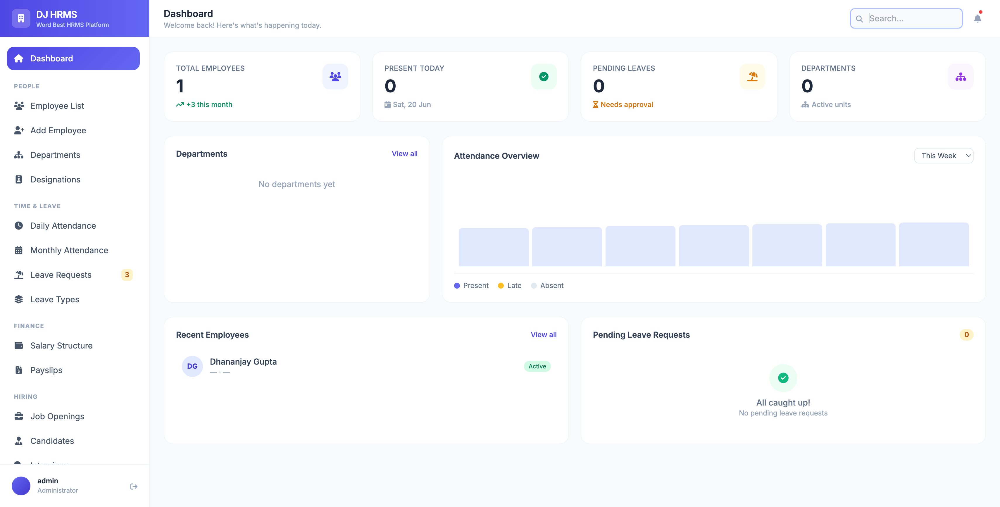 | 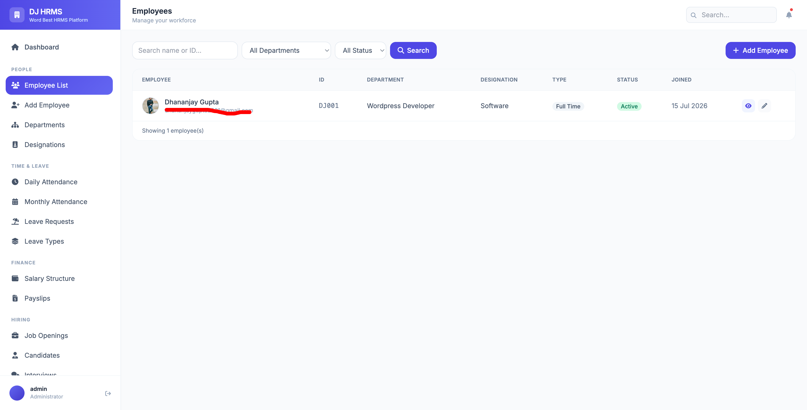 | 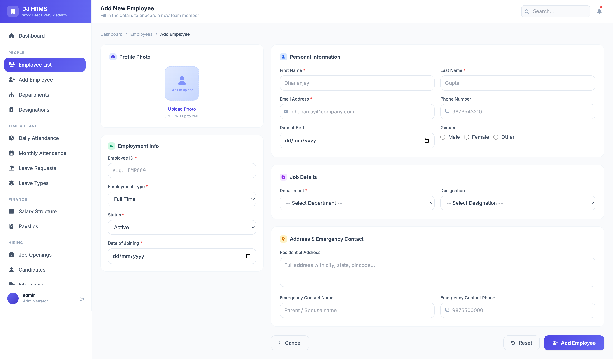 |

| Add Department | Daily Attendance | Monthly Attendance |
|:---:|:---:|:---:|
| 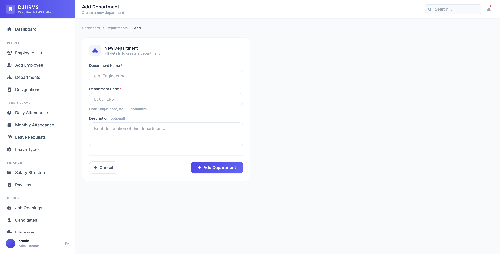 | 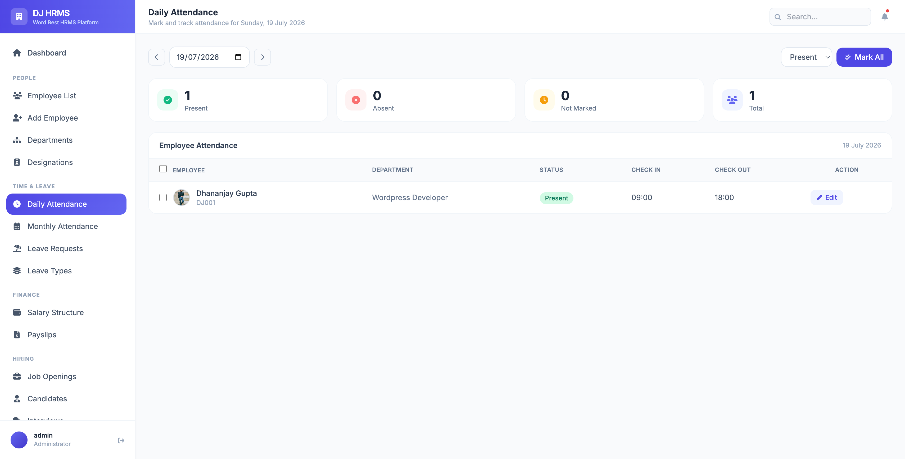 | 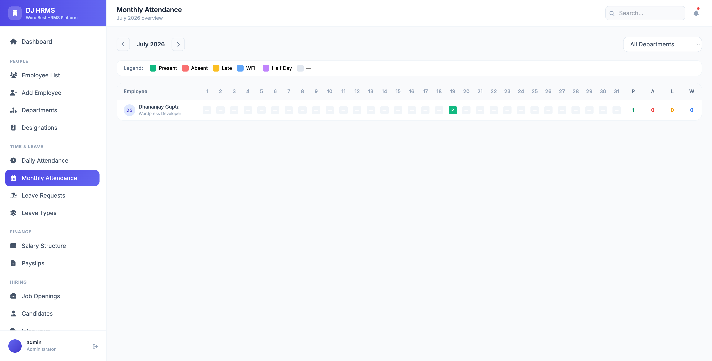 |

| Apply Leave | Leave Types | Add Leave Type |
|:---:|:---:|:---:|
| 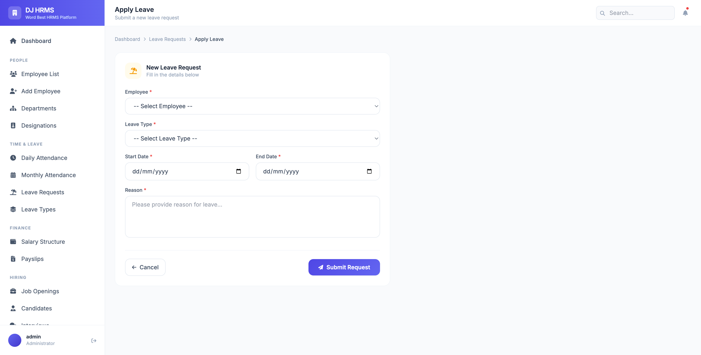 | 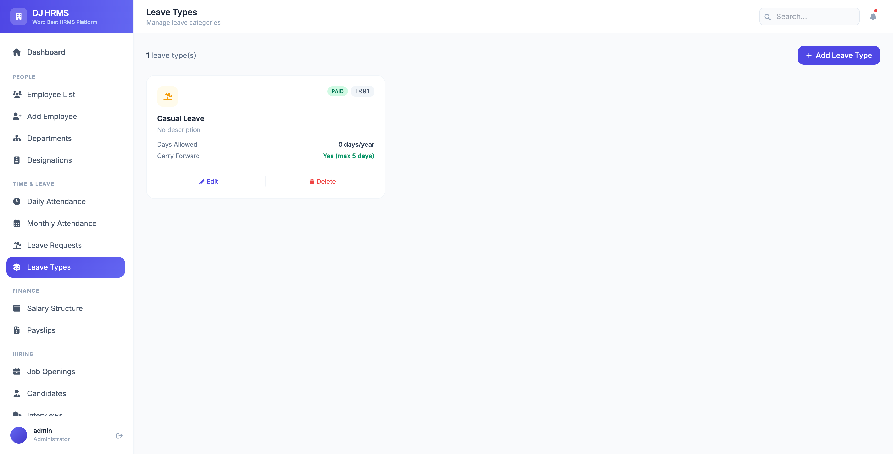 | 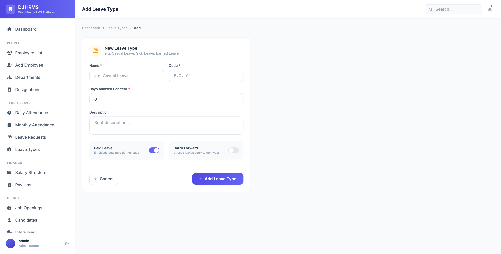 |

| WFH Requests (Admin review) |
|:---:|
| 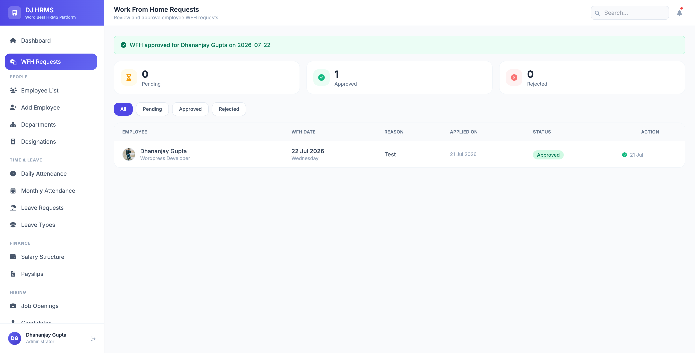 |

### Employee Self-Service Portal ("WorkForce")

| Portal Dashboard | My Attendance | Apply for Leave |
|:---:|:---:|:---:|
| 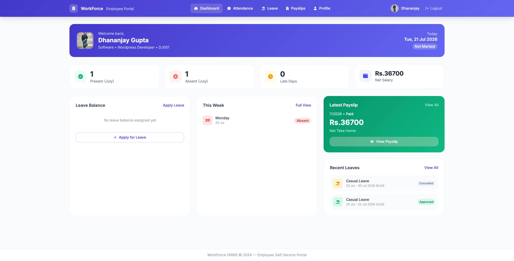 | 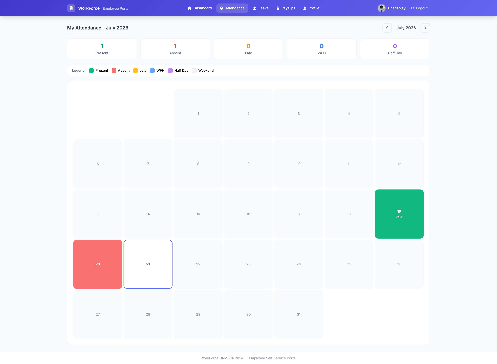 | 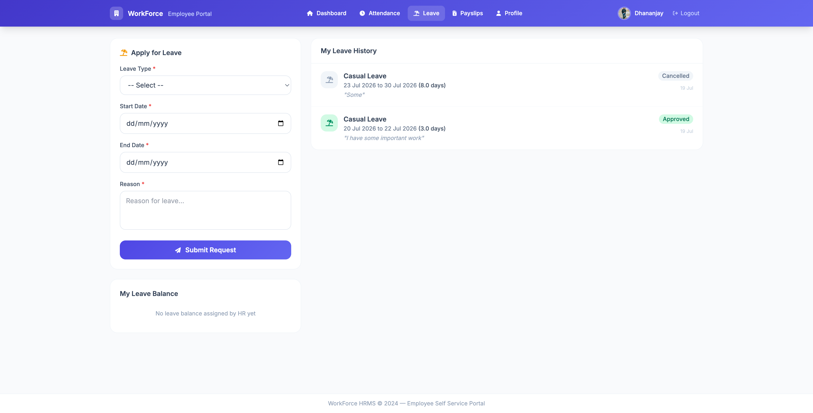 |

| My Payslip | Work From Home |
|:---:|:---:|
| 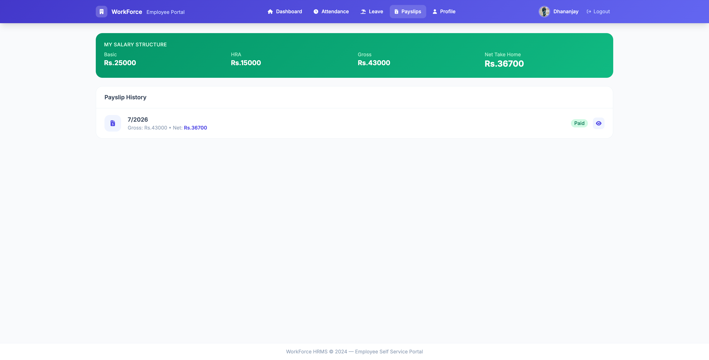 | 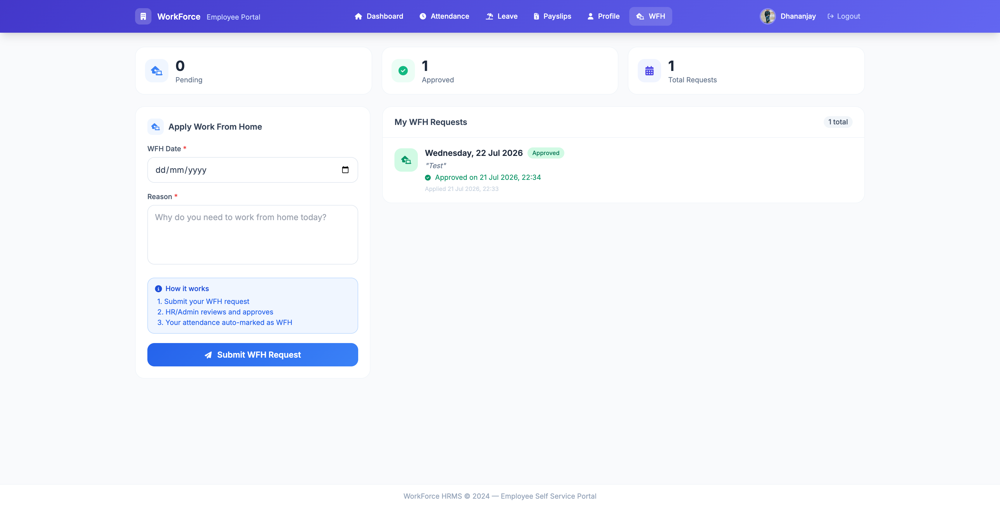 |

---

## 🗺️ Roadmap

- [x] Employee Management (CRUD)
- [x] Department & Designation Management
- [x] Daily & Monthly Attendance
- [x] Biometric device integration (ADMS push protocol)
- [x] Face-recognition attendance
- [x] Leave Management (types, requests, approvals, balances)
- [x] Work From Home workflow
- [x] Payroll & Payslip generation
- [x] Employee Self-Service Portal
- [x] Recruitment Pipeline (backend + API)
- [x] Expenses, Events, Wellness, Help Center modules
- [x] Internal Messaging
- [x] AI HR Assistant (Anthropic-powered chatbot)
- [x] Multi-tenant SaaS mode
- [x] REST API with DRF
- [ ] Recruitment Pipeline UI (kanban-style board)
- [ ] Email notifications
- [ ] Export to Excel / PDF
- [ ] React.js Frontend (SPA)
- [ ] Docker support
- [ ] CI/CD pipeline

---

## 🤝 Contributing

Contributions are welcome! Please follow these steps:

```bash
# Fork the repo, then:
git checkout -b feature/your-feature-name
git commit -m "feat: add your feature"
git push origin feature/your-feature-name
# Open a Pull Request
```

---

## 👨‍💻 Author

**Dhananjay Gupta**

[](https://github.com/dhan2501)

---

## 📄 License

This project is licensed under the **MIT License** — feel free to use, modify, and distribute.

---

<div align="center">

Made with ❤️ using Django & Tailwind CSS

⭐ **Star this repo if you find it helpful!**

</div>
